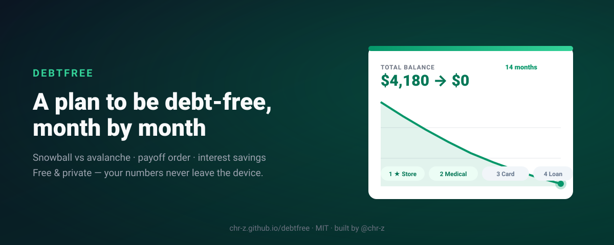

<div align="center">



# 🌱 DebtFree

**Snowball & avalanche debt payoff planner with a month-by-month exit date — free, private, offline-first.**
**Planejador de quitação de dívidas (bola de neve ou avalanche) com data de saída mês a mês — grátis, privado, offline.**

[](https://github.com/chr-z/debtfree/actions/workflows/ci.yml)
[](https://github.com/chr-z/debtfree/actions/workflows/pages.yml)
[](LICENSE)
[](#internationalization--internacionaliza%C3%A7%C3%A3o)
[](package.json)
[](manifest.json)

🔗 **Live demo → [chr-z.github.io/debtfree](https://chr-z.github.io/debtfree/)** · no signup, works offline after first load

</div>

---

Debt feels chaotic because it's never just one number: it's four balances, five rates, and a
minimum payment that keeps everything alive forever. DebtFree turns that mess into **one
constant monthly budget** and shows exactly what happens when you stop paying minimums in a
vacuum: every freed-up payment rolls into the next target debt, the chart bends, and "someday"
becomes **"14 months from now"**.

Everything runs in your browser. No account, no server, no telemetry — your numbers are nobody's
business but yours.

> 🇧🇷 Dívida vira bola de neve porque o pagamento mínimo nunca mata nada. O DebtFree monta um
> orçamento mensal fixo, mostra a ordem de quitação (**bola de neve** = menor saldo primeiro,
> **avalanche** = juro maior primeiro) e a data exata em que você fica livre — e quanto de juros
> cada estratégia economiza. Interface em português ou inglês, moeda em R$, US$, €, £, ¥ ou ₹.

## ✨ Features

| | |
|---|---|
| ⚡ **Two proven strategies** | Snowball (smallest balance first — motivation) vs Avalanche (highest APR first — mathematically cheapest), switchable with one click |
| 📅 **Exact debt-free date** | Month-by-month simulation with constant budget: when a debt dies, its minimum automatically rolls into the next target |
| 💰 **Interest-savings meter** | Compares your plan against frozen minimum-only payments and shows the money the strategy saves |
| 📉 **Balance chart** | Dependency-free inline SVG area chart of your total balance over time |
| 🎯 **Payoff order** | Named, numbered kill-list — ★ marks your first target |
| ⚠️ **Impossible-plan detector** | Tells you honestly when interest outgrows the budget instead of showing fake progress |
| 🖨️ **Save as PDF** | Print stylesheet outputs a clean one-page plan summary |
| 💾 **JSON export/import** | Your plan, portable: save everything, restore anywhere |
| 🌎 **EN / PT-BR + 6 currencies** | Language header switcher; USD, EUR, GBP, BRL, JPY, INR with proper `Intl` formatting |
| 📲 **Installable PWA** | Manifest + service worker: opens offline, installs on phone/desktop |
| 🛡️ **Private by design** | Zero runtime dependencies, zero network calls, zero cookies, zero telemetry |

## 🧠 How the simulation works (the senior-engineer part)

Not vibes — a cent-exact monthly loop:

```
budget       = Σ(minPayments) + extra          ← stays constant every month
each month:
  1. balance += balance × apr/12             ← interest accrues first
  2. every debt pays its minimum             ← dying debts stop consuming budget
  3. leftover cascades into the focus debt   ← lowest balance OR highest APR
until every balance hits zero (or the plan is declared impossible)
```

The engine is honest about failure: if accrued interest ever outgrows the budget it returns
`impossible` instead of simulating forever. The savings baseline amortizes each loan
independently with frozen minimums — the textbook "minimum payments trap". Every formula is
covered by **13 unit tests** running on Node's built-in test runner in CI.

## 🚀 Quick start

1. Open the [live demo](https://chr-z.github.io/debtfree/)
2. Click **Load example** — see a full payoff plan in 3 seconds
3. Replace with your real debts; drag nothing, sign nothing
4. Flip between Snowball and Avalanche and watch the interest meter
5. Hit **Save PDF**, put it on the fridge, start month 1

## 📸 Screenshots

| Plan dashboard | Balance curve |
|---|---|
|  | Stats react live as you edit any number |

## 💰 Pricing

| | Free | Pro *(planned)* |
|---|---|---|
| Price | **$0** forever | $29 one-time |
| Full snowball/avalanche planner | ✅ | ✅ |
| Interest-savings meter + chart | ✅ | ✅ |
| JSON export/import | ✅ | ✅ |
| Payment tracking & check-ins | — | ✅ |
| Multiple scenarios side-by-side | — | ✅ |
| Bill reminders (calendar export) | — | ✅ |

No ads, no tracking, no dark patterns. The app works fully offline once loaded.

## 🗺️ Roadmap

- [ ] v1.1 — multiple saved scenarios + side-by-side compare
- [ ] v1.2 — irregular extra payments (13th salary / tax refund mode)
- [ ] v1.3 — calendar export (.ics) of each debt's death month
- [ ] v1.4 — optional cloud-free sync via encrypted file links
- [ ] v2.0 — optional Pro license key (offline validation, like our other ForgeKit apps)

## ♿ Accessibility

Keyboard-navigable forms, visible focus rings, semantic landmarks, `aria-label`s on charts,
reduced-motion support, and color pairs tested for WCAG AA contrast.

## 🏗️ Tech notes

Vanilla JS ES modules, **zero runtime dependencies** (~14 KB of app code). Payoff math lives
in [`js/core.js`](js/core.js) as pure functions — tested with Node's built-in runner:

```bash
node --test tests/*.test.js   # 13 tests, no npm install needed
```

Deployed as a static site on GitHub Pages (CI runs tests before publishing).

## Internationalization / Internacionalização

Interface available in **English** and **Português (BR)** via the header selector — persisted in
`localStorage`, auto-detected from the browser on first visit. All strings live in
[`locales/en.json`](locales/en.json) and [`locales/pt-BR.json`](locales/pt-BR.json); adding a
language is one JSON file away.

## 🤝 Contributing

Issues and PRs welcome — see [CONTRIBUTING.md](CONTRIBUTING.md). Bug reports with a failing
`node --test` case get priority.

## 📄 License

[MIT](LICENSE) — use it, fork it, ship it.

---

<div align="center">

**Built by [@chr-z](https://github.com/chr-z)** · part of the *ForgeKit Labs* suite —
PriceCraft · ContractKit · LinkForge · MenuPulse · ResumeForge · DebtFree

</div>
